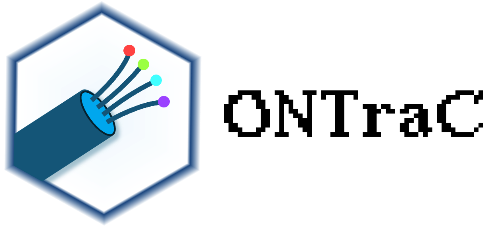
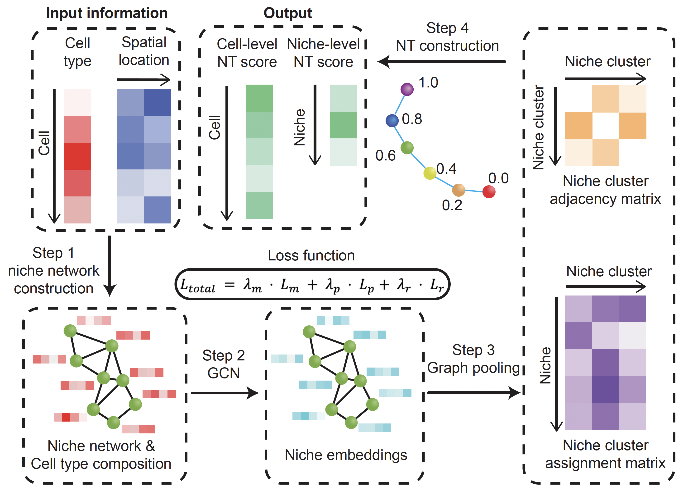

# **ONTraC**

ONTraC (Ordered Niche Trajectory Construction) is a niche-centered, machine learning
method for constructing spatially continuous trajectories. ONTraC differs from existing tools in
that it treats a niche, rather than an individual cell, as the basic unit for spatial trajectory
analysis. In this context, we define niche as a multicellular, spatially localized region where
different cell types may coexist and interact with each other.  ONTraC seamlessly integrates
cell-type composition and spatial information by using the graph neural network modeling
framework. Its output, which is called the niche trajectory, can be viewed as a one dimensional
representation of the tissue microenvironment continuum. By disentangling cell-level and niche-
level properties, niche trajectory analysis provides a coherent framework to study coordinated
responses from all the cells in association with continuous tissue microenvironment variations.




## Installation

```sh
pip install ONTraC
```

For details and alternative approches, please see the [installation tutorial](tutorials/installation.md)

## Tutorial

Please see [ONTraC website](https://ontrac-website.readthedocs.io/en/latest/) for details.

## Citation

**Wang, W.\*, Zheng, S.\*, Shin, C. S., Chávez-Fuentes J. C.  & [Yuan, G. C.](https://labs.icahn.mssm.edu/yuanlab/)$**. [ONTraC characterizes spatially continuous variations of tissue microenvironment through niche trajectory analysis](https://doi.org/10.1186/s13059-025-03588-5). ***Genome Biol***, 2025.
